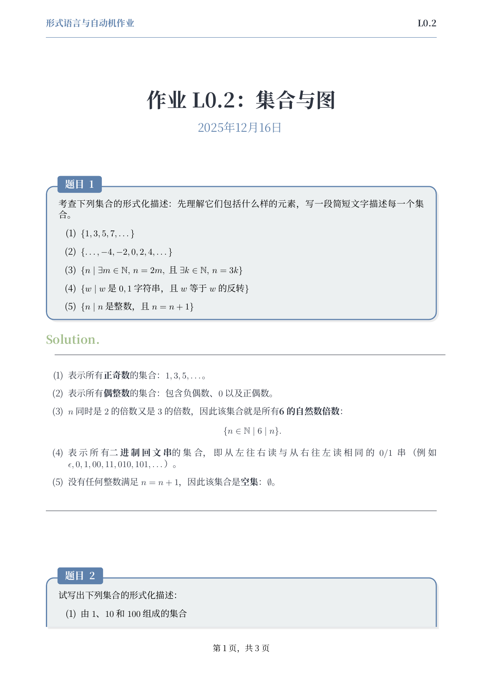
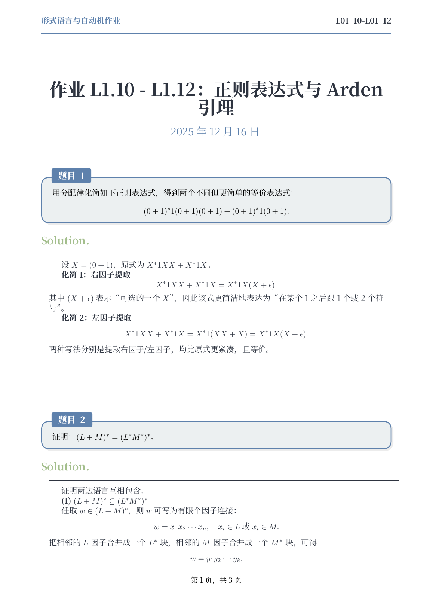
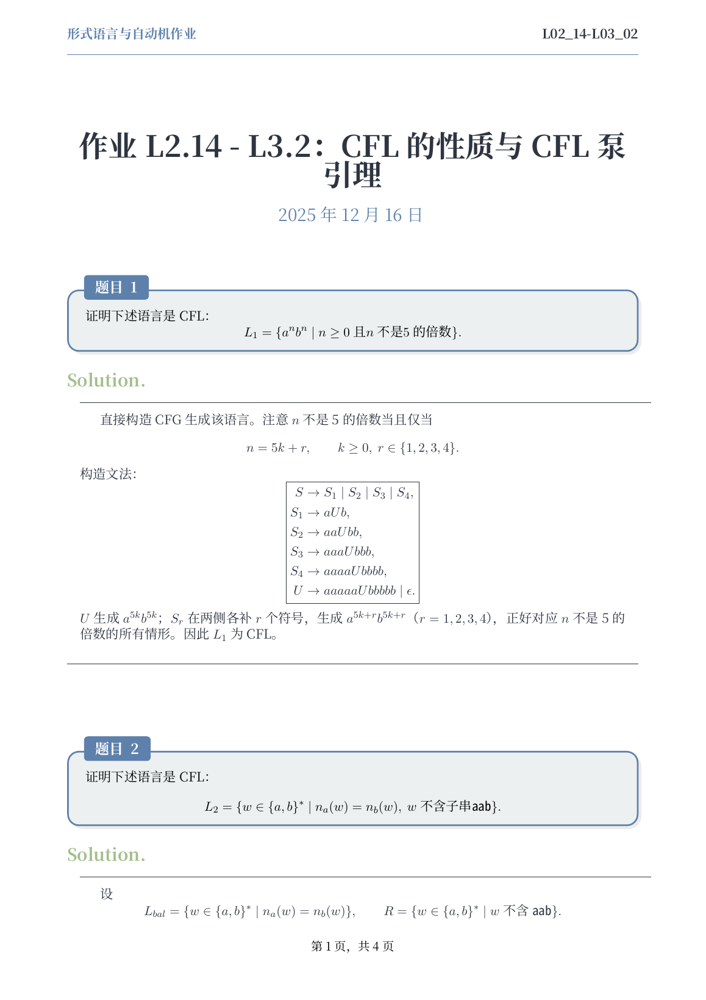

# 理论计算机科学：作业解答（LaTeX）

该仓库整理《理论计算机科学》课程作业解答，使用统一的 LaTeX 模板排版，按讲次范围（如 `L01_03-L01_05`）组织。

## 预览

点击缩略图可直接打开对应的 `main.pdf`（GitHub 预览页面会展示图片，从而看到排版视觉效果）。

| L00_02 | L01_10-L01_12 | L02_14-L03_02 |
| --- | --- | --- |
| <a href="homework/L00_02/main.pdf"></a> | <a href="homework/L01_10-L01_12/main.pdf"></a> | <a href="homework/L02_14-L03_02/main.pdf"></a> |

## Structure

- `homework/<RANGE>/main.tex`: 每份作业的解答源码
- `homework/<RANGE>/main.pdf`: 编译产物（可直接阅读）
- `homework/_shared/preamble.tex`: 共享排版模板
- `PROMPT.md`: 本仓库约定与工作流说明

> 说明：为避免版权/学术合规风险，本仓库默认不提交题面/课件 PDF；如你拥有授权，可自行在本地放入 `assets/` 与 `courseware/` 并移除对应的 `.gitignore` 规则。

## Build

需要安装 `latexmk` 与 XeLaTeX（例如 TeX Live）。

```bash
cd homework/L00_02
latexmk -xelatex -interaction=nonstopmode -halt-on-error main.tex
```
